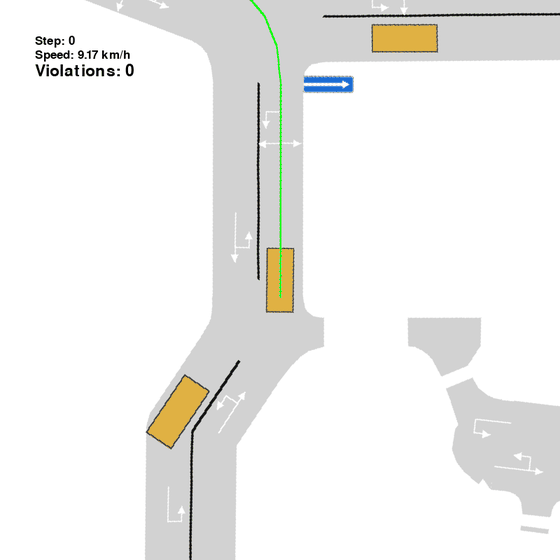
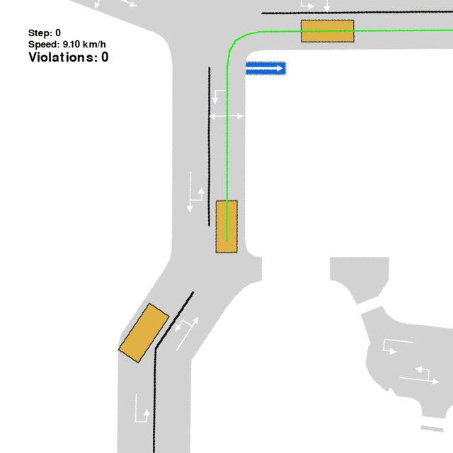
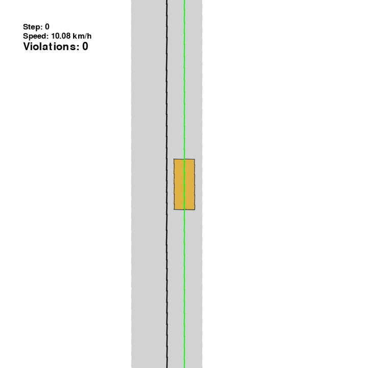
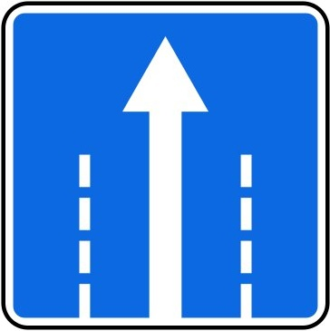
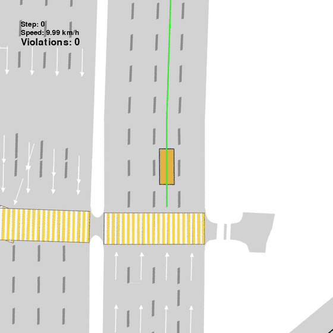
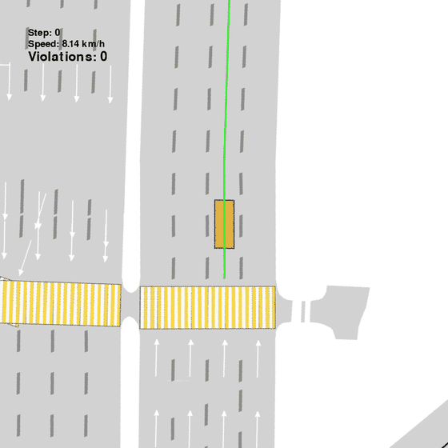

<p align="center">
  
  &nbsp;
  
  &nbsp;
  
  &nbsp;
  
  &nbsp;
  
  &nbsp;
  
</p>

<h1 align="center">TrafficRuleBench</h1>

<p align="center">
  <b>Closed-loop traffic-rule compliance for driving planners.</b><br>
  Real-map scenes · automatic sign checkers · oracle trajectories for fine-tuning.
</p>

<p align="center">
  <a href="https://emb-ai.github.io/traffic-rule-bench/"></a>
  <a href="https://huggingface.co/datasets/emb-ai/traffic-sign-bench"></a>
  <a href="https://huggingface.co/emb-ai/traffic-rule-bench-models"></a>
  <a href="https://github.com/emb-ai/traffic-rule-bench"></a>
</p>

---

Same scene, two planners. The **base** policy often breaks the rule. The **rule expert** stays legal.

<table>
  <tr>
    <th width="16%"></th>
    <th width="42%">Base planner</th>
    <th width="42%">Rule-compliant twin</th>
  </tr>
  <tr>
    <td align="center">
      <br>
      <b>One-way</b><br>
      <sub>5.7.1 · CaRL</sub>
    </td>
    <td align="center"></td>
    <td align="center"></td>
  </tr>
  <tr>
    <td align="center">
      <br>
      <b>No entry</b><br>
      <sub>3.1 · IDM</sub>
    </td>
    <td align="center"></td>
    <td align="center"></td>
  </tr>
  <tr>
    <td align="center">
      <br>
      <b>Lane directions</b><br>
      <sub>5.15.1 · IDM</sub>
    </td>
    <td align="center"></td>
    <td align="center"></td>
  </tr>
</table>

<p align="center">
  <a href="https://emb-ai.github.io/traffic-rule-bench/">More rollouts on the project site →</a>
</p>

---

## What this repo is for

Standard driving scores (route completion, collisions, comfort) can look great while the planner still runs a red brick, skips a yield, or drives the wrong way. This repo is the other scoreboard:

- **Evaluate** any policy in closed loop on real SUMO maps with the target sign placed and checked every step.
- **Score** the *sign that matters* (`target_compliant_event`) plus the usual driving metrics.
- **Collect** rule-expert trajectories and pick an oracle per scene for fine-tuning.

```
data/scenes/<sign>  →  eval manifest  →  eval run  →  eval metrics
                         └── oracle collect → select → finetune
```

| You want | Command |
|---|---|
| Debug a sign | `python -m traffic_bench.eval manifest sign=yield` then `run policy=idm sign=yield` |
| Full eval | `python -m traffic_bench.eval run policies=all sign=all` then `metrics combine sign=all` |
| Oracle data | `SIGN=yield ./traffic_bench/oracle/collect/collect.sh` |

Official eval ids: `yield`, `stop`, `main`, `roundabout`, `no_entry`, `direction/right`, `detour_left`, `speed_limit`, `crosswalk`, … — or `sign=all`.

---

## Install

```bash
git clone --recurse-submodules https://github.com/emb-ai/traffic-rule-bench
cd traffic-rule-bench
git submodule update --init --recursive

conda create -n traffic-rule-bench python=3.10
conda activate traffic-rule-bench

pip install -e third_party/metadrive
pip install eclipse-sumo sumolib pyproj stable_baselines3
pip install pandas "geopandas<1.0" gym timm
pip install -e .
```

PlanT2 / CaRL need their own weights (and PlanT2 its conda env). See [Checkpoints](#checkpoints).

---

## Scenes

Download the official per-sign maps into `data/scenes/<sign>/`:

```bash
pip install huggingface_hub
huggingface-cli download emb-ai/traffic-sign-bench \
    --repo-type dataset \
    --local-dir data
```

To harvest new maps from OSM instead: [`traffic_bench/scene_collection/`](traffic_bench/scene_collection/README.md).

---

## Evaluate

Three verbs. Outputs land in `data/runs/<sign>/<split>/`.

```bash
python -m traffic_bench.eval manifest sign=yield          # debug snapshot
python -m traffic_bench.eval run     policy=idm sign=yield
python -m traffic_bench.eval metrics combine sign=all
```

Locked splits: `paths.split=train` or `test`. Several policies / signs:

```bash
python -m traffic_bench.eval run \
    policies=[idm,comprehensive_rule_expert,plant2_ft] \
    sign=yield

python -m traffic_bench.eval run policies=all sign=all
```

GIFs for a visual check:

```bash
python -m traffic_bench.eval run policy=idm sign=yield gif.enabled=true gif.max_scenes=8
```

Full contract: [`traffic_bench/eval/README.md`](traffic_bench/eval/README.md).

### Metrics that actually move the needle

| Metric | Meaning |
|---|---|
| `target_compliant_event` | Ego obeyed **this** sign inside its zone |
| `arrived_dest` | Reached the destination |
| `route_completion` | Fraction of the route covered |
| `total_violations` | All sign / light / crosswalk events |
| `comfort` | nuPlan-style kinematic smoothness |

---

## Policies

| Family | Hydra id | Needs checkpoint |
|---|---|---|
| IDM | `idm` | — |
| IDM + rules | `comprehensive_rule_expert` | — |
| PPO + rules | `rule_compliant` | — |
| CaRL | `carl` / `carl_rule` | yes |
| PlanT2 | `plant2` / `plant2_rule` / `plant2_ft` | yes |

`policies=all` runs the registered set. `idm` is MetaDrive `ModifiedIDMPolicy`.

---

## Oracle trajectories

Collect expert rollouts, then pick the best run per scene:

```bash
SIGN=yield SMOKE=1 ./traffic_bench/oracle/collect/collect.sh

SIGN=yield,stop,direction/right ./traffic_bench/oracle/collect/collect.sh

python -m traffic_bench.oracle.select.coverage \
    --root data/trajectories/yield/trajectories_<ts> \
    --catalog data/trajectories/yield/trajectories_<ts>/catalog.jsonl \
    --signs yield --horizon 1500 \
    --out-dir data/trajectories/yield/trajectories_<ts>/experts
```

Details: [`traffic_bench/oracle/collect/README.md`](traffic_bench/oracle/collect/README.md). Fine-tune PlanT2 on the picks: [`finetune/`](finetune/README.md).

---

## Checkpoints

| Weights | Where they come from | Default path |
|---|---|---|
| CaRL (base) | [autonomousvision/CaRL](https://github.com/autonomousvision/CaRL) | `checkpoints/carl/nuplan_51479_1B/model_best.pth` |
| PlanT2 (pretrain) | [emb-ai/plant2](https://github.com/emb-ai/plant2) | `checkpoints/plant2_pretrain/epoch=029_final_3.ckpt` |
| PlanT2 (fine-tuned) | [emb-ai/traffic-rule-bench-models](https://huggingface.co/emb-ai/traffic-rule-bench-models) | `checkpoints/plant2_finetuned/` |

```bash
huggingface-cli download emb-ai/traffic-rule-bench-models --local-dir checkpoints
```

---

## Layout

```
traffic_bench/
  signs/              # runtime plates + violation checkers
  envs/               # SUMO env, spawn, NPCs, pedestrians
  agents/             # policies + CaRL / PlanT2 adapters
  eval/               # manifest → run → metrics
  oracle/             # collect → select → report
  scene_collection/   # OSM harvest (optional)
data/                 # gitignored working artifacts
  scenes/<sign>/
  runs/<sign>/<split>/
  trajectories/<sign>/
docs/                 # project site (GIFs, figures)
third_party/          # MetaDrive · PlanT2 · CaRL
```

| Package | Read this |
|---|---|
| Eval CLI | [`traffic_bench/eval/README.md`](traffic_bench/eval/README.md) |
| Oracle | [`traffic_bench/oracle/README.md`](traffic_bench/oracle/README.md) |
| Signs | [`traffic_bench/eval/signs/README.md`](traffic_bench/eval/signs/README.md) |
| Site | [`docs/README.md`](docs/README.md) · [live page](https://emb-ai.github.io/traffic-rule-bench/) |

Simulation backend: [emb-ai/metadrive](https://github.com/emb-ai/metadrive) (submodule).

---

## Citation

```bibtex
@misc{trafficrulebench2026,
  title        = {TrafficRuleBench: Evaluating Traffic-Rule Compliance in Autonomous Driving},
  author       = {EMB AI},
  year         = {2026},
  howpublished = {\url{https://github.com/emb-ai/traffic-rule-bench}},
  note         = {Code, scenes, and models}
}
```
