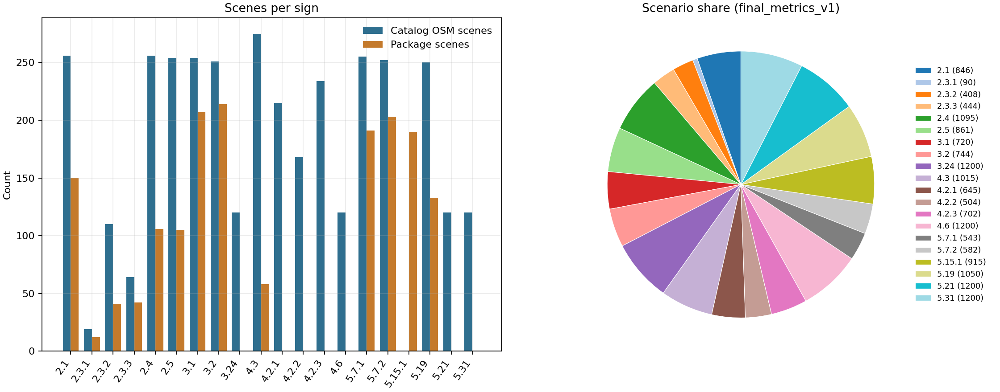
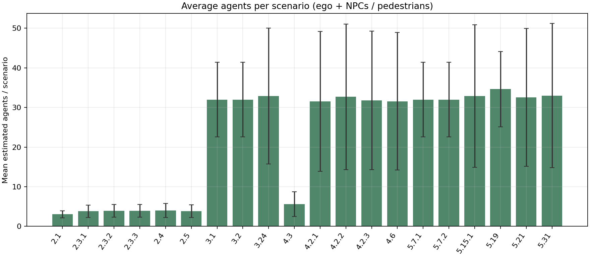
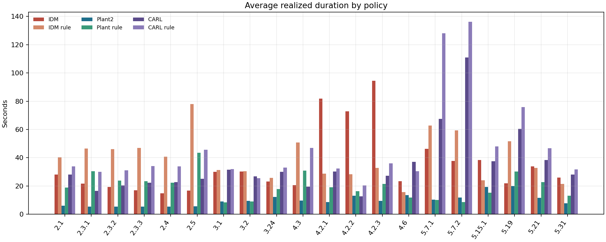
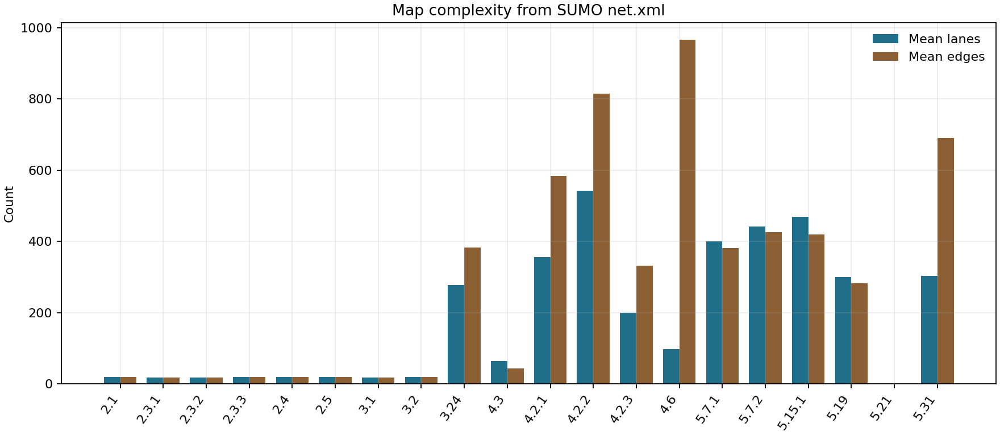
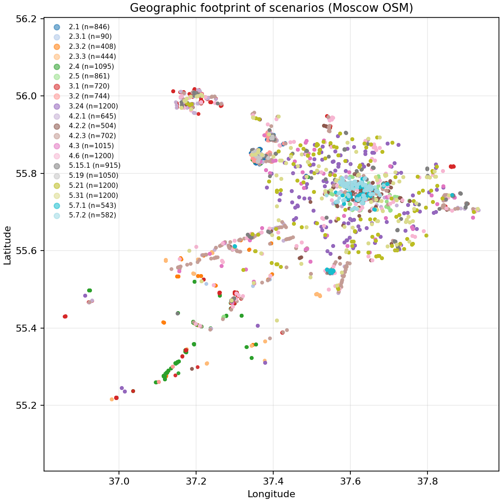

# Dataset statistical overview (reviewer response)

We thank the reviewer for requesting a high-level statistical overview of the
generated scenes. Below we report the **actual contents** of the released subset
covering priority / prohibitory / mandatory / special signs
(2.1, 2.3.1–2.3.3, 2.4, 2.5, 3.1–3.2, 3.24, 4.2.1–4.2.3, 4.3, 4.6,
5.7.1–5.7.2, 5.15.1, 5.19, 5.21, 5.31).

Speed / zone signs (3.24, 4.6, 5.21, 5.31) use the map-trimmed
`catalog_balanced_1k2.jsonl`. Detour signs (4.2.1–4.2.3) use
`detour_v1/catalog.jsonl`.

## Headline numbers

| Quantity | Value |
|---|---:|
| Signs in this overview | 20 |
| OSM catalog scenes | 3593 |
| Filtered package scenes | 1652 |
| Augmented scenarios (`final_metrics_v1`) | **15964** |
| Configured horizon (all scenarios) | **94 s** |
| Mean realized (IDM) | **30.3 s** |
| Mean realized (IDM rule) | **31.7 s** |
| Mean realized (Plant2) | **10.9 s** |
| Mean realized (Plant rule) | **18.4 s** |
| Mean realized (CARL) | **34.2 s** |
| Mean realized (CARL rule) | **41.1 s** |

### Agents by traffic design

| Traffic mode | Mean agents / scenario | N scenarios |
|---|---:|---:|
| Local auxiliary convoy (priority / roundabout) | **4.13** | 4759 |
| nuPlan density tiers (prohibitory / one-way / lane dirs) | **32.23** | 3504 |
| Ego-centric speed / zone (3.24, 4.6, 5.21, 5.31) | **32.51** | 4800 |
| Ego-centric detour (4.2.1–4.2.3) | **31.95** | 1851 |
| nuPlan density + pedestrians (crosswalk) | **34.63** | 1050 |

These are intentionally different designs: priority signs stress a small number of
interacting vehicles on the conflicting arm; density-augmented signs replay
nuPlan-calibrated traffic levels (low / medium / high ≈ 21 / 31 / 43 vehicles/frame).

We distinguish three nested units (all counted below):

1. **Catalog scenes** — OSM road crops centered on a real traffic sign.
2. **Package scenes** — geometrically validated / manually curated crops used for benchmarking.
3. **Scenarios** — evaluation units obtained by spawning / density / pedestrian augmentation
   of package scenes (what agents actually roll out).

## Distribution by sign

See `tables/sign_distribution.md` and `figures/fig_sign_distribution.png`.

| sign | 2.1 | 2.3.1 | 2.3.2 | 2.3.3 | 2.4 | 2.5 | 3.1 | 3.2 | 3.24 | 4.3 | 4.2.1 | 4.2.2 | 4.2.3 | 4.6 | 5.7.1 | 5.7.2 | 5.15.1 | 5.19 | 5.21 | 5.31 |
|---|---:|---:|---:|---:|---:|---:|---:|---:|---:|---:|---:|---:|---:|---:|---:|---:|---:|---:|---:|---:|
| Category | Priority | Priority | Priority | Priority | Priority | Priority | Prohibitory | Prohibitory | Prohibitory | Mandatory | Mandatory | Mandatory | Mandatory | Mandatory | Special | Special | Special | Special | Special | Special |
| Scenario % | 5.3% | 0.6% | 2.6% | 2.8% | 6.9% | 5.4% | 4.5% | 4.7% | 7.5% | 6.4% | 4.0% | 3.2% | 4.4% | 7.5% | 3.4% | 3.6% | 5.7% | 6.6% | 7.5% | 7.5% |

**Total scenarios:** 15964.



## Agents per scenario

See `tables/agents_and_duration.md` and `figures/fig_agents_per_sign.png`.

| Sign | Mean agents | Median | Range | Traffic mode |
|---|---:|---:|---:|---|
| 2.1 | 3.03 | 3.0 | 2–7 | aux_convoy |
| 2.3.1 | 3.80 | 3.0 | 2–7 | aux_convoy |
| 2.3.2 | 3.91 | 3.0 | 2–7 | aux_convoy |
| 2.3.3 | 3.95 | 3.0 | 2–7 | aux_convoy |
| 2.4 | 4.02 | 3.0 | 2–13 | aux_convoy |
| 2.5 | 3.84 | 3.0 | 2–7 | aux_convoy |
| 3.1 | 32.00 | 31.0 | 21–44 | density |
| 3.2 | 32.00 | 31.0 | 21–44 | density |
| 3.24 | 32.89 | 32.0 | 2–81 | speed_ego |
| 4.3 | 5.61 | 5.0 | 2–21 | aux_convoy |
| 4.2.1 | 31.52 | 31.0 | 2–81 | detour_ego |
| 4.2.2 | 32.69 | 31.0 | 2–81 | detour_ego |
| 4.2.3 | 31.82 | 31.0 | 2–81 | detour_ego |
| 4.6 | 31.56 | 30.0 | 2–81 | speed_ego |
| 5.7.1 | 32.00 | 31.0 | 21–44 | density |
| 5.7.2 | 32.00 | 31.0 | 21–44 | density |
| 5.15.1 | 32.89 | 31.0 | 2–81 | density |
| 5.19 | 34.63 | 34.0 | 22–48 | density_ped |
| 5.21 | 32.57 | 31.0 | 2–81 | speed_ego |
| 5.31 | 33.01 | 31.0 | 2–81 | speed_ego |

Do not average across modes naively: convoy signs and density signs answer different
interaction questions. Prefer the per-mode means in the headline table.



## Duration

Priority / density scenarios use a **600-step / 60 s** MetaDrive horizon;
speed / zone signs use **1500-step / 150 s**; detour signs use **1200-step / 120 s**.
Realized episode length (until arrival / crash / timeout) is shorter on average.

| Sign | Horizon (s) | IDM (s) | IDM rule (s) | Plant2 (s) | Plant rule (s) | CARL (s) | CARL rule (s) |
|---|---:|---:|---:|---:|---:|---:|---:|
| 2.1 | 60 | 28.2 | 40.3 | 6.0 | 18.8 | 28.1 | 33.8 |
| 2.3.1 | 60 | 21.7 | 46.5 | 5.3 | 30.5 | 16.5 | 30.0 |
| 2.3.2 | 60 | 19.4 | 46.0 | 5.5 | 23.7 | 20.4 | 31.2 |
| 2.3.3 | 60 | 16.9 | 47.0 | 5.3 | 23.5 | 22.3 | 34.1 |
| 2.4 | 60 | 14.8 | 40.8 | 5.5 | 22.3 | 22.9 | 33.8 |
| 2.5 | 60 | 16.7 | 78.0 | 5.7 | 43.5 | 25.2 | 45.6 |
| 3.1 | 60 | 30.1 | 31.3 | 9.0 | 8.5 | 31.5 | 31.9 |
| 3.2 | 60 | 30.3 | 30.4 | 9.6 | 9.1 | 26.7 | 25.5 |
| 3.24 | 150 | 23.2 | 25.7 | 12.3 | 17.8 | 29.9 | 33.1 |
| 4.3 | 60 | 20.6 | 50.9 | 9.6 | 30.9 | 19.6 | 46.9 |
| 4.2.1 | 120 | 81.9 | 28.8 | 8.7 | 19.1 | 30.2 | 32.5 |
| 4.2.2 | 120 | 72.8 | 28.4 | 13.2 | 16.4 | 12.7 | 20.4 |
| 4.2.3 | 120 | 94.4 | 32.8 | 9.4 | 21.6 | 27.4 | 36.0 |
| 4.6 | 150 | 23.4 | 15.7 | 13.5 | 11.9 | 37.2 | 30.4 |
| 5.7.1 | 60 | 46.4 | 62.9 | 10.3 | 10.0 | 67.6 | 128.1 |
| 5.7.2 | 60 | 37.7 | 59.4 | 11.9 | 8.6 | 110.9 | 136.3 |
| 5.15.1 | 60 | 38.4 | 24.1 | 19.3 | 15.2 | 37.6 | 48.0 |
| 5.19 | 60 | 21.8 | 51.8 | 20.0 | 30.2 | 60.3 | 75.9 |
| 5.21 | 150 | 34.0 | 32.7 | 11.7 | 22.8 | 38.4 | 46.7 |
| 5.31 | 150 | 26.1 | 21.5 | 7.8 | 13.0 | 28.1 | 31.8 |

Realized duration from eval aggregations / metrics_per_episode: idm (`idm_*`), idm_rule (`modified_idm_*` / `comprehensive_rule_expert_*`), plant2 (`plant2_default`), plant_rule (`plant2_rule_default`), carl (`carl_default`), carl_rule (`carl_rule_default`).

Compact planner-only table: `tables/duration_by_planner.md`.



## Map complexity & geography

Cropped SUMO maps typically contain hundreds of lanes/edges; junction crops are
multi-arm (T / X / roundabout). See `tables/map_complexity.md`,
`figures/fig_map_complexity.png`, and `figures/fig_geo_footprint.png`.





## Category mix

| Category | Scenarios | % |
|---|---:|---:|
| Special | 5490 | 34.4% |
| Mandatory | 4066 | 25.5% |
| Priority | 3744 | 23.5% |
| Prohibitory | 2664 | 16.7% |

## Coverage notes

- **3.24:** Speed / zone signs from balanced run_v61_a6 catalog (map-trimmed 1.2k); NPC density sampled from row seed via sample_one_profile (same as catalog-direct eval); agents ≈ 1 + density×80. Configured horizon = 1500 steps (150 s).
- **3.24:** Local OSM crops=255; unique scenes in balanced catalog=120 (catalog count uses the balanced unique scenes).
- **4.2.1:** Detour signs from detour_v1/catalog.jsonl; NPC density sampled from row seed via sample_one_profile (catalog-direct eval); agents ≈ 1 + density×80. Horizon = 1200 steps (120 s).
- **4.2.2:** Detour signs from detour_v1/catalog.jsonl; NPC density sampled from row seed via sample_one_profile (catalog-direct eval); agents ≈ 1 + density×80. Horizon = 1200 steps (120 s).
- **4.2.3:** Detour signs from detour_v1/catalog.jsonl; NPC density sampled from row seed via sample_one_profile (catalog-direct eval); agents ≈ 1 + density×80. Horizon = 1200 steps (120 s).
- **4.6:** Speed / zone signs from balanced run_v61_a6 catalog (map-trimmed 1.2k); NPC density sampled from row seed via sample_one_profile (same as catalog-direct eval); agents ≈ 1 + density×80. Configured horizon = 1500 steps (150 s).
- **4.6:** Local OSM crops=12; unique scenes in balanced catalog=120 (catalog count uses the balanced unique scenes).
- **5.15.1:** No top-level OSM catalog mirror for this sign.
- **5.21:** Speed / zone signs from balanced run_v61_a6 catalog (map-trimmed 1.2k); NPC density sampled from row seed via sample_one_profile (same as catalog-direct eval); agents ≈ 1 + density×80. Configured horizon = 1500 steps (150 s).
- **5.31:** Speed / zone signs from balanced run_v61_a6 catalog (map-trimmed 1.2k); NPC density sampled from row seed via sample_one_profile (same as catalog-direct eval); agents ≈ 1 + density×80. Configured horizon = 1500 steps (150 s).
- **5.31:** Local OSM crops=81; unique scenes in balanced catalog=120 (catalog count uses the balanced unique scenes).

## Reproducibility

```bash
cd pdd-bench/scripts/dataset_stats
python collect_stats.py
python plot_and_report.py
```

Artifacts: `output/raw/`, `output/tables/`, `output/figures/`.
