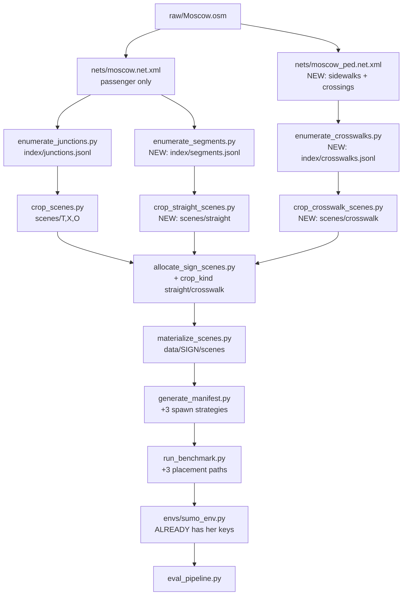

/no_think
# Знаки на прямых участках: 5.19, 4.2.1-4.2.3, скоростные

## Что уже готово и что переносить не надо

- **Слой среды общий.** `priority_bench/run_benchmark.py:41` импортирует `envs.sumo_env.TrafficSignSumoEnv` — тот же env, который коллега расширила на +386 строк (скорость) и +126 (объезд). В [pdd-bench/envs/sumo_env.py](pdd-bench/envs/sumo_env.py) уже есть её конфиг-ключи: `ego_braking_spawn` (стр. 260), `ego_spawn_mode` = `brake|accel` (261), `ego_v_target_kmh` (264), `ego_brake_d_required`, `spawn_detour_cones` (253), `detour_clear_before_sign_m`. Плюс готовая процедура `_spawn_ego_before_sign`, которая **разворачивает approach вверх по предшественникам** (до 30 хопов, с защитой от U-turn на встречную), если требуемой дистанции не хватает на текущем ребре (стр. 1437-1600) — именно это нужно для сегментов из нескольких рёбер.
- **Эксперты готовы:** `_handle_speed_limit` ([_sign_compliance_mixin.py:2005](pdd-bench/agents/policies/_sign_compliance_mixin.py)), `_handle_min_speed` (2026), `_handle_detour` (2201), `_detour_target_lane` (2309), `_handle_pedestrian_yield` (2920), `_speed_cap`/`_speed_floor` (3264-3284).
- **Классы знаков готовы:** `speed_limit_sign.py`, `min_speed_limit_sign.py`, `zone_signs.py`, `residential_zone_signs.py`, `detour_sign.py`, `detour_obstacle.py`, `pedestrian_yield_rule.py`, `envs/pedestrian_manager.py`.

### Важная поправка: `_build_sumo_env` в priority_bench её ключи НЕ проставляет

Env их принимает, но наш билдер их не передаёт. Путь коллеги — `scripts/per_sign_bench/run_benchmark.py` + [bench/env_builders.py](pdd-bench/scripts/per_sign_bench/bench/env_builders.py), а `priority_bench/run_benchmark.py` — отдельный форк на ~4k строк со своим `_build_sumo_env` (стр. 287), без braking/accel-spawn, без `_sample_profile_for_catalog_row`, без интеграции с `bench/`. Так что задача `runtime-placement` больше, чем «поставить знак»: надо прокинуть весь набор ключей и сэмплирование NPC-профилей.

Заодно там же баг коллеги, который надо починить при переносе: `bench/env_builders._build_sumo_env` **не читает `spawn_detour_cones`** из строки каталога, поэтому ось `detour_cones` 50/50 в catalog-direct прогонах не работает — конусы ставятся всегда.

**Вывод:** переносить надо харвест сцен (`moscow_scenes`), генерацию манифеста и прокидку env-ключей (`priority_bench`). Наработки коллеги по *дизайну* сцен переносятся как формулы и константы, дословно.

### Второй блокер: на прямой дороге priority_bench даёт ноль spawn-полос

`generate_manifest.parse_sumo_net_for_spawn_lanes` (стр. 273-338) и `scene_augmentation.parse_intersection_approach_lanes` (296-358) оставляют только полосы, чья `to`-junction имеет тип из `INTERSECTION_JUNCTION_TYPES`. На сегменте без перекрёстка это **пустой список**, и сцена молча отбрасывается. Плюс `augment_layout_for_scene` (стр. 1001) всегда вызывает `build_junction_priority_layout`, который падает с `JunctionLayoutError` при менее чем 2 входящих плечах. Поэтому в Фазе 3 нужен не только новый layout-модуль, но и **отдельный парсер spawn-полос** для сегментов.

## Обоснование дизайна карт (то, что будут читать ревьюеры)

### Принцип 1: единый провенанс — sign-free геометрия + программная установка знака

Все существующие 12 семейств помечены `"harvest": "sign_free_moscow_osm"` (см. `crop_scenes.py:143`): мы берём реальную геометрию OSM **без знаков** и ставим знак программно. Новые семейства делаем так же — из того же `nets/moscow.net.xml` (145 МБ, BBBike Moscow extract, воспроизводимо через `build_net.py`).

Три следствия, ценные для статьи:
- Ground truth точный по построению (мы знаем `sign_s`, зону, полосу — не восстанавливаем из OSM-тегов).
- Возможны **matched counterfactuals**: та же геометрия со знаком и без. У коллеги эта идея уже есть частично (ось `detour_cones` 50/50: конусы+знак против только знака) — обобщаем её на скоростные знаки как контрольное условие. Это отделяет «агент читает знак» от «агент просто едет осторожно».
- Один train/test split по географии на весь бенчмарк. У коллеги split делается по **карте** (`net_path`) через `make_map_split.py`, стратифицированно по группам sign_code — наш split по географии это обобщает.

**Сильный довод в пользу этого решения нашёлся в её же коде.** У неё есть [redistribute_scenes.py](pdd-bench/scripts/osm_scene_collection/redistribute_scenes.py), который **переносит папки сцен между знаками** (3.24 → 4.6, 3.24 → 5.31, 5.21 → 5.31), меняя только имя каталога и `meta.json["sign_type"]`. Комментарий прямо говорит: геометрия sign-agnostic. То есть она уже пришла к выводу, что привязка сцены к реальной позиции знака не нужна — важна пригодная геометрия дороги. Харвест прямых сегментов из Москвы это доводит до логического конца и снимает необходимость в `redistribute_scenes` как костыле.

Это же снимает и дефицит донорских сцен, из-за которого `redistribute_scenes` появился: в текущем чекауте `scenes/4.6` содержит всего **12** сцен, `scenes/5.31` — 81, а `scenes/5.21` и `scenes/5.22` — **ноль** (при том что её каталог ссылается на 10 120 строк по 5.21/5.22, то есть её результаты по 5.21 в `report_cumulative.md` получены на пуле вне этого репозитория, `/home/jovyan/shares/SR006.nfs2/smirnova/...`, и здесь невоспроизводимы). Из московского нета мы нарежем сколько нужно на каждое семейство.

### Принцип 2: геометрические критерии выводятся из физики задачи, а не назначаются

Это главный ответ на вопрос «почему такие пороги». У коллеги в [sumo_catalog.py:75-93](pdd-bench/scripts/per_sign_bench/sumo_space/sumo_catalog.py) уже есть аналитическая модель, и её комментарий формулирует смысл сцены:

```
BRAKE_DIST_FACTOR = 1.0
# Full braking distance (=1.0): a SIGN-AWARE agent has exactly enough room to
# brake from v0 to v_target by the sign and comply; a SIGN-UNAWARE agent that
# doesn't brake enters the zone at v0 > v_target and VIOLATES. This is the whole
# point of the scene — discriminate aware vs unaware, not test braking strength.
```

Отсюда **требуемая длина прямого участка не выбирается, а считается**:

- Тормозной путь: `d_brake = (v0² - v_target²) / (2a) + v0·t_delay + margin`, при `a = 3.5 м/с²`, `t_delay = 0.5 с`, `margin = 3.0 м` (её `BRAKE_DECEL_MPS2_DEFAULT`, `BRAKE_DELAY_S_DEFAULT`, `BRAKE_MARGIN_M_DEFAULT`).
- Худший случай её дизайна: `v0 = min(60, limit + 30)` км/ч, `v_target ∈ {20, 30, 40}`. Для `v0 = 60`, `v_target = 20`: `d_brake ≈ 46.6 м`.
- Пост-знаковая зона для проверки удержания скорости: не менее 4 с движения на разрешённой скорости, то есть `≥ 60 м`.
- Итог для скоростных знаков: **`total_length_m ≥ 120`**, целевое окно 150-250 м. Порог выводится, и это записывается в `meta.json` полем `length_requirement_derivation`.

Аналогично для 4.6 (accel-spawn): ego стартует на 15 км/ч ниже минимума (`ACCEL_DEFICIT_KMH = 15.0`), нужен разгон до минимума плюс окно удержания — около 60 м после знака.

Для 4.2.x длина выводится из констант `DetourSign`: `SIGN_TO_OBSTACLE = 3.5`, `ZONE_BEFORE = 30.0`, полуразмах конусов 2.25 — значит нужен upstream-запас на перестроение (зона нарушения 30 м) плюс место после препятствия.

### Принцип 3: прямизна измеряется двумя метриками, порог привязан к боковому ускорению

Для скоростных знаков дорога обязана быть строго прямой — иначе замедление на кривой невозможно отличить от соблюдения знака. Это не абстрактное требование: у нас в базовом IDM есть curve-aware defensive layer (коммит `2906eeb`), то есть **и наивная политика тоже сбросит скорость на кривой**, и метрика теряет разделяющую способность.

Считаем по полилинии `lane.shape` две величины:
- `chord_ratio = |P_end − P_start| / arc_length` (1.0 = идеально прямая),
- `total_abs_heading_change_deg` и `min_curvature_radius_m`.

Порог привязываем к комфортному боковому ускорению: требуем `v²/R ≤ 1.0 м/с²` на скорости въезда. При `v0 = 60` км/ч (16.7 м/с) это `R ≥ 278 м`.
- Скоростные: `chord_ratio ≥ 0.995`, `total_heading_change ≤ 5°`, `R_min ≥ 278 м`.
- 5.19 и 4.2.x: кривизна допустима (по ПДД перекрёсток не нужен), но знак должен быть виден с дистанции остановки — `chord_ratio ≥ 0.97`, `total_heading_change ≤ 25°`.

Третью метрику берём готовой из репозитория, чтобы порог был не только выведенным, но и уже обкатанным: `_heading_std_deg` (круговое стандартное отклонение курсов по полилинии) из [overtaking_sign/lib/straight_pair.py](pdd-bench/scripts/per_sign_bench/overtaking_sign/lib/straight_pair.py) с её парой порогов `min_length_m = 60.0`, `max_heading_std_deg = 12.0`. Этот модуль переносим в `lib/segments.py` и используем `heading_std` как мягкий фильтр для 5.19/4.2.x, а строгие `chord_ratio`/`R_min` — для скоростных.

Дополнительно для 4.2.x геометрические предикаты берём из её [detour_scene_editor.py](pdd-bench/scripts/osm_scene_collection/detour_scene_editor.py): `radius = 75.0`, `min_edge_len = 45.0`, `target_sign_s = 60.0`, `EDGE_TAIL_MARGIN = 12.0`, `SHORT_RUNWAY_S = 40.0` и правило пригодности полосы (в SUMO полоса 0 — крайняя правая): 4.2.1 требует соседа с меньшим индексом, 4.2.2 — с большим, 4.2.3 — любого. У неё эти предикаты работают как *пост-фильтр* и отбрасывают 153 из 770 сцен (19.9%, в основном `no_multilane_edge_in_radius`). У нас они становятся *условием харвеста*, и доля отбраковки падает почти до нуля — ещё один аргумент за нарезку из большого нета.

### Принцип 4: сегмент — это участок без промежуточных перекрёстков

Сегмент = максимальная цепочка последовательных направленных рёбер, где все промежуточные узлы — проходные (не входят в `INTERSECTION_JUNCTION_TYPES`, arm_count < 3), с постоянным числом полос и направлением. Это гарантирует, что политике не надо решать задачу приоритета — измеряется ровно реакция на знак.

### Принцип 5: split без утечки

Существующий split по `junction_id` ([make_junction_split.py](pdd-bench/scripts/per_sign_bench/moscow_scenes/scripts/make_junction_split.py)) для сегментов недостаточен: два сегмента одного OSM way геометрически почти идентичны. Делаем **пространственно-блочный split**: ключ = OSM way id, плюс сетка 1 км — все сегменты одной ячейки уходят в один сплит. Это надо явно написать в статье.

### Принцип 6: равномерность ограничений вместо nearest-snap

Переносим её решение дословно и с обоснованием. Комментарий в `sumo_catalog.py:249-251`: round-robin по `{20, 30, 40}` вводился вместо nearest-snap, потому что nearest-snap отправлял **85% сцен на v40**, где сцены не дискриминативны. Плюс `MIN_SPEED_FLOOR_KMH = 35.0` — сцены 4.6 с минимумом ниже базового круиза (~30 км/ч) отбрасываются как неразделяющие.

### Принцип 7: починить in-zone dropout

В её прогоне `run_v61_a6` по 5.21 только 3250 из 5060 прогонов дошли до зоны (64%), по 5.31 — 2740 из 5040 (54%). То есть половина эпизодов ничего не измеряет. На прямых сегментах без перекрёстка этот показатель должен быть близок к 1. Добавляем гейт виабельности в генерацию манифеста (геометрическая проверка, что маршрут spawn → dest проходит зону знака) и отчёт по in-zone rate на семейство.

Для справки, целевой разрыв по метрике `Sign compliance (in-zone)` из её отчёта — по 3.24 он уже отличный: `carl_default` 0.262 против `carl_rule_default` 0.888.

## Блокер, который надо снять первым: пешеходная инфраструктура для 5.19

`moscow.net.xml` содержит **0** рёбер `function="crossing"`, потому что [build_net.py:137-140](pdd-bench/scripts/per_sign_bench/moscow_scenes/scripts/build_net.py) вызывает netconvert с `--remove-edges.by-vclass pedestrian` и `--keep-edges.by-vclass passenger`. В нетах коллеги переходы есть (в `sign_71853.net.xml` их 10).

А вся существующая реализация 5.19 опирается именно на crossing-рёбра: `crosswalk_crop.py` ищет `function="crossing"`, `crosswalk_layout.py` их парсит, `CrosswalkPedestrianManager` по ним строит траектории.

Решение: собрать **второй нет** `nets/moscow_ped.net.xml` из того же `raw/Moscow.osm` с пешеходной инфраструктурой, не трогая основной нет. Тогда `crosswalk_crop.py` и `pedestrian_manager.py` работают без изменений, а геометрия зебры остаётся из реального OSM, а не синтезированной.

Точный набор флагов брать не из документации, а из её коллектора (`build_sign_scenes_from_osm_async.py:329-339`) — он уже проверен на 525 нетах:

```bash
netconvert --osm-files <osm> -o <net> \
  --osm.sidewalks --osm.crossings --crossings.guess --walkingareas
```

Это надо проверить спайком до основной работы — от результата зависит вся ветка 5.19 (см. Фаза 0).

### Вторая особенность 5.19: класса знака не существует

В отличие от остальных семейств, у 5.19 **нет класса знака вообще**. Механика собрана иначе: `CrosswalkPedestrianManager` + `PedestrianYieldRule`, зарегистрированное через `env.add_rule(...)`, а не `add_traffic_sign(...)`; зона нарушения берётся из полигона перехода в карте; бакет нарушений определяется по вхождению подстроки `pedestrian` в имя класса правила. Существующий `crosswalk_sign/run_benchmark.py` запускается с `skip_auto_signs=True` и **не ставит физическую табличку 5.19** — агент видит только зебру на дороге.

Для статьи это дырка: семейство называется «знак 5.19», а знака в сцене нет.

**Решение (подтверждено):** ставим реальную табличку 5.19 у перехода (визуальный ассет + запись в `meta.json`), сохраняя `PedestrianYieldRule` как источник факта нарушения — то есть добавляем восприятие знака, но не переписываем её проверенную логику нарушения. Это же даёт для 5.19 ту же ось `sign_present`, что и для остальных семейств.

## Архитектура после изменений



## Что именно переносится от коллеги (и остаётся неизменным)

Явное соответствие, чтобы её работа была сохранена и прослеживалась:

- Формулы и константы дизайна сцен из [sumo_catalog.py](pdd-bench/scripts/per_sign_bench/sumo_space/sumo_catalog.py) стр. 27-96: `BRAKING_SPAWN_CODES`, `ACCEL_SPAWN_CODES`, `ACCEL_DEFICIT_KMH`, `ACCEL_V0_FLOOR_KMH`, `MIN_SPEED_FLOOR_KMH`, `ALLOWED_LIMITS_KMH`, `SPEED_LIMIT_TARGETS_KMH`, `BRAKE_*_DEFAULT`, `V0_MAX_EXCESS_KMH`, `EGO_MAX_SPAWN_MPS`, `BRAKE_DIST_FACTOR` — переезжают целиком в новый `core/scenarios/speed_scene_design.py` **вместе с комментариями-обоснованиями**, без правок значений.
- Логика присвоения целевых лимитов (round-robin `{20,30,40}`; для 4.6 least-filled по `{40,50,60}`) — стр. 208-253, переносится дословно.
- `braking_required_distance` и `sample_spawn_velocity_above_limit` из `factorized_space/agent_profile_bank.py` — используются как есть, импортом.
- Её env-логика (`ego_braking_spawn`, walk-up approach, obstacle-lane из meta, traffic near sign, late merge) — не трогаем вообще.
- Её обработчики в `_sign_compliance_mixin.py` и `comprehensive_rule_expert.py` — не трогаем.
- `redistribute_scenes.py` (балансировка количества сцен между знаками, cap mode) — переиспользуется на этапе аллокации.
- `detour_scene_editor.py` — сохраняем как инструмент ревью, адаптируем пути под новый пул.
- `sign_edge_orientation.py` / `reorient_zone_signs.py` — переиспользуются для выбора направления ребра под знак.
- `scripts/osm_scene_collection/` (её сбор из OSM) остаётся на месте как воспроизводимый артефакт прошлого PR; новый пул его не использует, но и не удаляет.

## Порядок работы: блоки с точкой проверки

Работа разбита на 11 блоков. После каждого — стоп, артефакт для проверки и явное «идём дальше». Блоки упорядочены так, чтобы каждый следующий опирался на уже проверенный предыдущий, и чтобы **ни один блок не ломал существующие 12 семейств** до самого конца.

Общее правило проверки: существующий пайплайн должен продолжать работать. Регрессионная проверка после каждого блока, который трогает `priority_bench`:

```bash
cd pdd-bench/scripts/per_sign_bench/priority_bench
python generate_manifest.py --sign stop --count 5   # должно работать как раньше
```

### Блок 1: спайки (только чтение, код не пишем)

**Зачем первым:** от результата зависит объём Блока 4 и пороги в Блоке 2. Дешевле узнать сейчас.

- Собрать `moscow_ped.net.xml` на bbox центра (не на всей Москве — быстро) флагами коллеги `--osm.sidewalks --osm.crossings --crossings.guess --walkingareas`. Посчитать `function="crossing"`, из них долю mid-block (вне крупных перекрёстков), проверить выживание при кропе через `lib/crop_xy.py`.
- Прототип перебора сегментов на том же bbox: выход сцен при строгих (скорость) и мягких (5.19/4.2.x) порогах.

**Что проверяете:** две таблички с числами. Сколько mid-block переходов и сколько сегментов на семейство при каждом наборе порогов.

**Решения на выходе:** (1) 5.19 идёт на реальных переходах OSM или на синтетической зебре; (2) финальные пороги прямизны и длины — можно ли позволить строгие, или выход сцен заставляет ослабить.

**Артефакты:** временные, в `/tmp`. Репозиторий не меняется.

### Блок 2: харвест прямых сегментов

- `moscow_scenes/lib/segments.py` (новый): `SegmentPick`, обход графа рёбер, метрики `chord_ratio` / `total_abs_heading_change_deg` / `min_curvature_radius_m` / `heading_std_deg` / `n_lanes` / `speed_kmh` / `has_opposite_carriageway` / `dist_to_prev_junction_m`, предикаты на семейство (включая lane-feasibility для 4.2.x).
- `moscow_scenes/scripts/enumerate_segments.py` → `index/segments.jsonl` + `index/segments_summary.json`, по образцу `enumerate_junctions.py` (`latitude`/`longitude`/`rank`/`source_net`).

**Что проверяете:** `index/segments_summary.json` — распределение по длине, числу полос, скорости, `chord_ratio`, и сколько сегментов проходит фильтр каждого семейства. Плюс глазами несколько записей `segments.jsonl` на осмысленность координат.

**Почему отдельный блок:** это чистое чтение нета, ничего не создаётся в `scenes/`. Если пороги окажутся неудачными, правка стоит одну переменную.

### Блок 3: кроп сегментных сцен и split

- `moscow_scenes/scripts/crop_straight_scenes.py` → `scenes/straight/<family>/<scene_id>/`, кроп через существующий `lib/crop_xy.py`.
- `moscow_scenes/scripts/make_segment_split.py`: split без утечки по OSM way id + сетка 1 км.
- `meta.json` сегментной сцены: общие ключи как у junction-сцен (`scene_name`, `scene_kind`, `latitude`, `longitude`, `net_file`, `source_net`, `source_project`, `harvest`) плюс `segment_id`, `edge_ids`, `total_length_m`, `n_lanes`, `osm_speed_kmh`, `chord_ratio`, `total_heading_change_deg`, `min_curvature_radius_m`, `heading_std_deg`, `sign_s`, `sign_lane_index`, `length_requirement_derivation`.

**Что проверяете:** нарезанные сцены. Каждый кроп загружается в SUMO без ошибок, `meta.json` заполнен, ego-ребро выжило целиком (не обрезано пополам). Визуально несколько сцен. И что split не сажает два сегмента одного way в разные половины.

### Блок 4: пешеходные карты для 5.19

Объём зависит от Блока 1. Идёт отдельно от Блоков 2-3, потому что использует **другой нет**.

- `build_net.py`: флаг `--pedestrian` → `nets/moscow_ped.net.xml` (основной нет не меняется).
- `scripts/enumerate_crosswalks.py` → `index/crosswalks.jsonl`, переиспользуя `count_net_crossings` / `parse_crossing_junction_id` из `crosswalk_sign/lib/crosswalk_layout.py`.
- `scripts/crop_crosswalk_scenes.py`: переносим `prune_net_to_single_crosswalk` из [crosswalk_crop.py](pdd-bench/scripts/per_sign_bench/crosswalk_sign/lib/crosswalk_crop.py) (единственный переход в сцене — правильная идея, сохраняем).
- Отбор: переход не ближе N м от перекрёстка (чтобы задача была про пешехода, а не про приоритет), достаточный approach для остановки, `chord_ratio ≥ 0.97`.

**Что проверяете:** `scenes/crosswalk/` — в каждой сцене ровно один переход, он mid-block, approach достаточной длины.

### Блок 5: перенос дизайна сцен коллеги (изолированный модуль)

Самый безопасный блок: новый файл, который ничего не вызывает и никем ещё не вызывается.

- `priority_bench/core/scenarios/speed_scene_design.py` — дословный перенос её констант и формул из `sumo_catalog.py:27-96` и логики присвоения лимитов (`sumo_catalog.py:208-253`) **вместе с комментариями-обоснованиями**, без правки значений.
- `braking_required_distance` / `sample_spawn_velocity_above_limit` — импортом из `factorized_space/agent_profile_bank.py`, не копией.

**Что проверяете:** тест-сверка, что на одном и том же входе новый модуль выдаёт **побитово те же** `v0`, `d_required`, `v_target_kmh`, что её `sumo_catalog.py`. Это гарантия, что её работа перенесена, а не переписана.

### Блок 6: сегментное ядро priority_bench

Первый блок, который трогает общий код. Всё делается аддитивно.

- `signs/base.py`: поле `scene_kind: Literal["junction","straight","crosswalk"]` в `SignProfile` (по умолчанию `"junction"` — существующие 17 профилей не меняются) и 8 новых профилей: `crosswalk` (5.19), `detour_right`/`detour_left`/`detour_either` (4.2.1-3), `speed_limit` (3.24), `min_speed` (4.6), `residential_zone` (5.21), `zone_speed_limit` (5.31).
- `core/scenarios/scene_augmentation.py`: расширить `SpawnStrategy` (стр. 23-32) значениями `speed_zone`, `detour`, `crosswalk`.
- `parse_straight_road_spawn_lanes` — отдельный парсер spawn-полос вместо junction-фильтра (снимает блокер: иначе сегментные сцены дают ноль полос и молча отбрасываются).
- `core/layout/segment_layout.py` (новый) — аналог `junction_priority_layout.py` для прямой дороги: выбор ego-полосы, `sign_s`, разворачивание approach вверх по рёбрам, вычисление destination.
- `configs/sign/*.yaml`: 8 новых конфигов; `splits/signs.yaml`: 8 записей с `crop_kind: straight|crosswalk`; поддержка новых crop_kind в `allocate_sign_scenes.py` и `build_scenes/materialize_scenes.py`.

**Что проверяете:** для нарезанных сцен layout строится без исключений и spawn-полосы непустые. Плюс **обязательная регрессия**: старые семейства (`stop`, `yield`, `main_road`) генерируют манифест как раньше.

### Блок 7: манифесты

- `core/manifest/speed_expansion.py`, `detour_expansion.py`, `crosswalk_expansion.py` — по контракту существующих `no_turn_expansion.py` / `no_entry_expansion.py`.
- `generate_manifest.py`: три новых генератора и ветки в диспетчере (сейчас цепочка на стр. 2324-2360).

**Что проверяете:** `real_manifest.jsonl` для каждого из 8 новых семейств. Число строк, оси разложения, наличие полей braking/accel-spawn в строках скоростных знаков, `sign_lane_index` в строках 4.2.x.

### Блок 8: runtime

- `run_benchmark.py`: `_place_speed_sign` / `_place_detour_sign` / `_place_crosswalk` (с физической табличкой 5.19).
- **Полная** прокидка её env-ключей в `_build_sumo_env` (стр. 287), которых там сейчас нет ни одного: `ego_braking_spawn`, `ego_spawn_mode`, `ego_spawn_v0_ms`, `ego_brake_d_required`, `ego_v_target_kmh`, `spawn_detour_cones`, `detour_clear_before_sign_m`, `use_pedestrian_manager`, `use_pedestrian_yield_rule`, плюс сэмплирование NPC-профилей по образцу `_sample_profile_for_catalog_row` из `bench/env_builders.py`.
- Починить её баг: `spawn_detour_cones` не читается из строки каталога в `bench/env_builders._build_sumo_env`, из-за чего ось `detour_cones` 50/50 не работает и конусы ставятся всегда.
- Забрать коммит `8abc42e` (сэмплирование дистанции упреждающего перестроения на эпизод для 4.2.x) — эквивалента в HEAD нет.

**Что проверяете:** по одному эпизоду на семейство с GIF. Ego спавнится выше лимита на нужной дистанции, тормозит к знаку; конусы стоят там, где сказано в meta; пешеход выходит; табличка 5.19 видна.

### Блок 9: метрики

- Метрика соблюдения лимита: доля времени выше лимита и средняя скорость относительно лимита внутри зоны. Сейчас такой метрики нет — `driving_efficiency` это прокси Bench2Drive по скорости окружающего потока, а не по знаку (именно он давал значения 100-300 в отчётах).
- Починить устаревший маппинг `TARGET_CLASS_SUBCLASSES` в `build_episode_metrics_csv.py` для новых семейств, иначе нарушения не попадут в целевой бакет.

**Что проверяете:** на эпизодах из Блока 8 метрики считаются и попадают в целевой бакет; для явного нарушителя метрика ненулевая.

### Блок 10: контрольные оси и гейт виабельности

- Ось `sign_present ∈ {true, false}` для скоростных, 4.2.x и 5.19 — контроль, что метрика измеряет чтение знака, а не общую осторожность.
- Гейт виабельности маршрута через зону знака + отчёт in-zone rate на семейство (цель: заметно выше её 54-64% на 5.21/5.31).

**Что проверяете:** in-zone rate близок к 1, и в манифесте есть обе половины оси `sign_present`.

### Блок 11: валидация и уборка

- Smoke: по 3-5 сцен на семейство, сверка `comprehensive_rule_expert` против `idm` по `Sign compliance (in-zone)`. Критерий приёмки — разрыв не хуже, чем у неё на 3.24 (0.89 против 0.26).
- Прогон `eval_pipeline.py` на train/test сплитах.
- `crosswalk_sign/`, `speed_signs/`, `sumo_space/` → `_old/`. `overtaking_sign/` (3.20) не трогаем по решению.
- Обновить `priority_bench/README.md` и `moscow_scenes/README.md`: новые crop_kind, вывод порогов, обоснование двух нетов.

**Что проверяете:** таблица разрывов эксперт/наивная политика по всем 8 семействам — это и есть результат для статьи.

## Открытый вопрос, который решится в Блоке 1

Если mid-block переходов в `moscow_ped.net.xml` окажется мало, для 5.19 переходим на синтетическую зебру на прямом сегменте (тогда `crosswalk_layout.py` заменяется генератором геометрии, а `pedestrian_manager.py` получает полигон из `meta.json`). Это меняет объём Блока 4, но не остальные блоки.