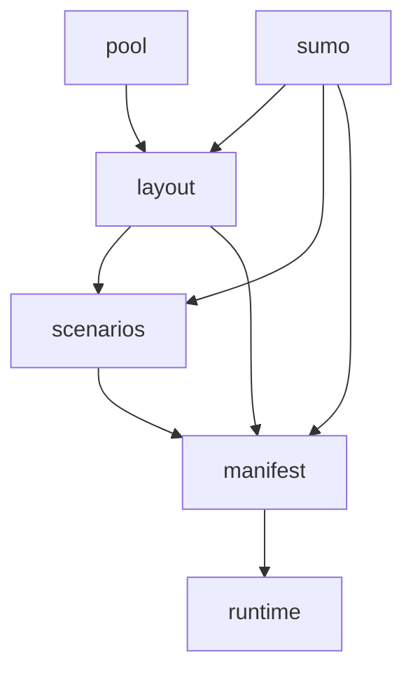

# `core/` — shared library for priority-junction benches

Python package used by `priority_bench` (manifest generation, simulation,
scene pool) and by `moscow_scenes` crop scripts. Imports always go through
`core.<subpackage>.<module>` — there are no flat modules at the `core/` root.

## Layout

```
core/
├── README.md
├── sumo/           SUMO .net.xml parsing, lane keys, scene file helpers
├── layout/         Junction geometry, sign placement, roundabout topology, crop
├── scenarios/      Ego/aux spawn enumeration and runtime aux agents
├── manifest/       Manifest defaults, expansion axes, viability filters
├── profiles/       nuPlan sampler + CSV stats, ego/NPC IDM profiles, stable_hash
├── patches/        MetaDrive monkey-patches (HUD text, GIF overlays, RecordManager)
├── pool/           Moscow scene pool + keep/reject selection state
└── runtime/        MetaDrive SUMO patches + sign-zone / crash helpers
```

## Subpackages

### `sumo/`

Low-level SUMO / MetaDrive lane identity.

| Module | Role |
|--------|------|
| `lane_keys.py` | Parse/build `lane_<edge>_<num>` keys (handles `#` in edge ids) |
| `sumo_utils.py` | Drivable-lane filters, route index, `meta.json` / net path helpers |

**Used by:** almost everything that reads a cropped `map.net.xml`.

### `layout/`

Junction structure derived from a cropped net.

| Module | Role |
|--------|------|
| `junction_priority_layout.py` | T/X/O arms, main vs secondary, conflict tables |
| `junction_sign_placement.py` | Longitudinal/lateral offsets for MetaDrive signs |
| `junction_crop.py` | Crop city net to junction bbox (moscow harvest + legacy) |
| `roundabout_topology.py` | Ring + spoke layout for 4.3 |
| `roundabout_yield_zone.py` | Entry conflict arcs / yield zones on the ring |

**Used by:** `generate_manifest`, `run_benchmark`, `moscow_scenes/scripts/crop_scenes.py`.

### `scenarios/`

Which ego/aux spawn + destination combinations exist per scene.

| Module | Role |
|--------|------|
| `scene_augmentation.py` | `SpawnStrategy` enumerators (equal / yield / roundabout / blocked_road / one_way / direction) |
| `auxiliary_agent.py` | Aux convoy spawn, placement, release logic at runtime |
| `roundabout_aux.py` | Conflict-arc placement + spillover convoy on the ring |
| `blocked_road_route.py` | Forbidden-lane geometry checks for 3.2 |
| `dual_path_scene.py` | Shared crop-meta dual-path geometry (4.1 / 5.7) |
| `one_way_bridge.py` | 5.7 dual-path from crop `meta.json` |
| `direction_bridge.py` | 4.1 dual-path from crop `meta.json` |

**Used by:** manifest expansion, viability reject, `run_benchmark` aux spawn.

### `profiles/`

nuPlan ego/NPC IDM profiles + precomputed statistics.

| Module | Role |
|--------|------|
| `nuplan_sampler.py` | `NuPlanSampler` over `nuplan_statistics/` CSVs |
| `nuplan_statistics/` | densities, speeds, following, routes, … |
| `agent_profile_bank.py` | `sample_one_profile`, speed v0 / braking distance |
| `ego_defaults.py` | `apply_ego_defaults` / `sample_ego_params` (s1–s4) |
| `stable_hash.py` | Deterministic seeds for expansions |

**Used by:** `generate_manifest` expansions, `run_benchmark`, `speed_scene_design`.

### `manifest/`

Turning scenes into `real_manifest.jsonl` rows.

| Module | Role |
|--------|------|
| `manifest_config.py` | Shared defaults (`spawn_distance_before_end`, stop wait, …) |
| `manifest_expansion.py` | Layout × aux cartesian product (2.1 / 2.4 / 4.3) |
| `manifest_viability.py` | Pre-manifest scene filters (`reject_unusable_scenes`) |
| `blocked_road_expansion.py` | Layout × `n_variations` nuPlan NPC profiles for 3.2 |
| `one_way_expansion.py` | Dual-path × `n_variations` NPC profiles for 5.7.1 / 5.7.2 |
| `direction_expansion.py` | Dual-path × `n_variations` NPC profiles for 4.1.1–4.1.6 |

**Used by:** `generate_manifest.py`, `build_scenes/reject_unusable_scenes.py`.

### `pool/`

Moscow allocation bookkeeping under `data/<sign>/scenes/`.

| Module | Role |
|--------|------|
| `moscow_pool.json` helpers in `moscow_pool.py` | Train/test split map, pool snapshot |
| `scene_selection.py` | Visual review keep/reject + `_rejected/` moves |

**Used by:** `materialize_scenes`, `review_scenes`, manifest split filter.

### `runtime/`

| Module | Role |
|--------|------|
| `metadrive_sumo_patch.py` | Strip invalid SUMO via-chains before MetaDrive graph build |
| `sign_eval.py` | Sign-zone heuristic, violation labels, crash-fault attribution |

**Used by:** `run_benchmark.py`, `plant2_finetune/plant2_frames.py`, `eval_pipeline.py`.

### `patches/`

| Module | Role |
|--------|------|
| `top_down_text_patch.py` | Larger Violations HUD font |
| `top_down_path_conflict_patch.py` | Ego/aux route + conflict overlays on GIFs |
| `record_manager_patch.py` | Tolerant spawn between reset and first step |

**Used by:** `run_benchmark.py`, `sumo_space/sumo_runner.py`.

## Dependency flow (high level)



1. **Pool** picks junction crops (`materialize_scenes`).
2. **Layout + sumo** parse each crop’s net and classify arms.
3. **Scenarios** enumerate valid ego/aux or through-path variants.
4. **Manifest** expands axes, filters viability, writes JSONL.
5. **Runtime** patches MetaDrive; bench reads manifest rows.

## Import examples

```python
# Preferred — explicit subpackage
from core.sumo.lane_keys import make_lane_key
from core.scenarios.scene_augmentation import SpawnStrategy
from core.manifest.manifest_config import DEFAULT_SPAWN_DISTANCE_BEFORE_END

# Convenience re-exports (stable public surface)
from core import SpawnScenario, build_junction_priority_layout
```

## Adding a new sign family

1. Add a `SignProfile` in `signs/base.py` with `spawn_strategy`.
2. If needed, extend `scenarios/scene_augmentation.py` with a new enumerator.
3. Wire expansion in `manifest/` (generic `manifest_expansion.py` or a sign-specific module like `blocked_road_expansion.py`).
4. Add viability rules in `manifest/manifest_viability.py`.
5. Document the sign in this README’s scenario/manifest tables.

**3.18.x / 3.1** use dual-path crops (same stack as 4.1 / 5.7):
`no_turn_*` / `no_entry` profiles, bridges, and expansion modules under
`scenarios/` + `manifest/`. Slot balance is only in
`moscow_scenes/scripts/allocate_sign_scenes.py`.
