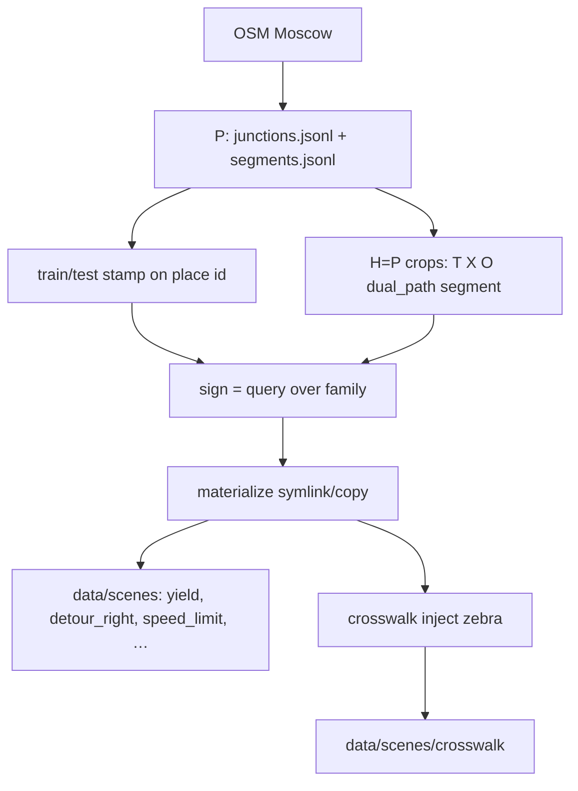

# scene_collection — Moscow maps without signs, then signs as queries

Two stages:

1. **map_pool** — harvest a shared, sign-free pool of Moscow maps.
2. **sign_pool** — each sign samples that pool (`splits/signs.yaml`) and
   materializes into `data/scenes/<sign>/`.

CLI (`--sign`, Hydra `sign=`) uses **eval profile ids** (`yield`, `roundabout`,
`crosswalk`, …), the same names as `generate_manifest.py`. Allocations in
`signs.yaml` / `sign_allocations.json` stay keyed by PDD code internally.

The independent unit of the benchmark is a **map**. Scenario augmentations
(≤10 per map) are correlated; quotas `n_train=80` / `n_test=20` are the
official protocol size, not the harvest size.

## Three sizes

| Symbol | Meaning | This iteration |
| ------ | ------- | -------------- |
| **P** | Full Moscow population in the index | junctions 6457 (T 5181 / X 1052 / O 224); segments 7620 |
| **H** | Cropped nets on disk | **H = P** (crop until the city runs out; no cap of 500) |
| **N** | Official maps per sign | 80 train + 20 test |

T/X **50/50** in `signs.yaml` is PDD topology stratification, not Moscow’s
~83% T mix. 20 test maps is a wide CI (~±22 pp at p=0.5); that is the protocol,
not a sampling parameter of the harvest.

## Order

Stamp train/test on **place identity** before allocating to signs:

- junctions / dual_path: `junction_id`
- segments: `osm_way_id` (one street must not sit in both halves)

The same `junction_id` may appear in both T/X junction crops **and** dual_path
crops; that sharing is intentional. A place must not be train for one sign and
test for another.



## Five crop families

```
map_pool/crops/T/
map_pool/crops/X/
map_pool/crops/O/
map_pool/crops/dual_path/{T,X}/{slot}/
map_pool/crops/segment/<scene_id>/
```

`straight` / `curved` / lane count are **tags** on a segment crop (`meta.json`),
not extra folders. dual_path is a different net (path-union bbox), which is why
it is its own family.

Signs that are **not** harvested this round: **5.15** (eval code stays; no
`lane_direction` in `signs.yaml`). Leftover `crops/lane_direction`,
`segment_detour`, `segment_crosswalk` on disk are unused.

## From scratch

All commands from the repo root `traffic-rule-bench`. If `nets/` / `crops/` /
`index/` are empty, this is the full sequence.

### 1. City net

```bash
python traffic_bench/scene_collection/map_pool/scripts/build_net.py
```

OSM extract → `map_pool/nets/moscow.net.xml`. If osm/net already exist:
`--skip-download --skip-netconvert`.

### 2. Index places, then stamp train/test

The label is on the **place**, not the crop. Split as soon as the junction
index exists, before (or in parallel with) cropping.

```bash
python traffic_bench/scene_collection/map_pool/scripts/enumerate_junctions.py --shapes T,X,O
python traffic_bench/scene_collection/map_pool/scripts/make_junction_split.py
python traffic_bench/scene_collection/map_pool/scripts/enumerate_segments.py
```

Segment train/test is stamped later in allocate, by `osm_way_id`.

### 3. Crop all five families (H = P)

Independent of each other after enumerate. ~5 s/netconvert; interrupt-safe
with `--skip-existing`.

```bash
python traffic_bench/scene_collection/map_pool/scripts/crop_scenes.py \
  --shapes T,X,O --skip-existing

python traffic_bench/scene_collection/map_pool/scripts/crop_dual_path_scenes.py \
  --max-per-slot 0 --skip-existing

python traffic_bench/scene_collection/map_pool/scripts/crop_segment_scenes.py \
  --max-scenes 0 --skip-existing
```

Same harvest in one wrapper (download + enumerate + crops; **does not** run
split or allocate):

```bash
python traffic_bench/scene_collection/map_pool/scripts/run_pipeline.py --skip-existing
```

After the wrapper, still run `make_junction_split.py` (if not done) and step 4.

### 4. Allocate signs

```bash
python traffic_bench/scene_collection/map_pool/scripts/allocate_sign_scenes.py
```

Reads `map_pool/splits/signs.yaml` → `sign_allocations.json`.

### 5. Materialize into `data/scenes/<sign>/`

`--sign` is the eval id (Hydra `sign=`), not the PDD code.

```bash
python traffic_bench/scene_collection/sign_pool/materialize_scenes.py --sign yield
python traffic_bench/scene_collection/sign_pool/reject_unusable_scenes.py \
  --sign yield --apply --refill --loop
```

Repeat for every harvested sign (table below). `crosswalk` injects a zebra
into `data/scenes/crosswalk/` instead of symlinking the raw segment.

Optional visual review, then refill again:

```bash
python traffic_bench/scene_collection/sign_pool/review_scenes.py \
  --scenes-dir data/scenes/yield
python traffic_bench/scene_collection/sign_pool/review_scenes.py \
  --scenes-dir data/scenes/yield --apply
python traffic_bench/scene_collection/sign_pool/materialize_scenes.py \
  --sign yield --refill
```

### 6. Manifest (eval, not harvest)

```bash
python traffic_bench/eval/generate_manifest.py sign=yield paths.split=train
```

## Eval id ↔ PDD (harvested this round)

| `--sign` / `sign=` | PDD | Family |
| --- | --- | --- |
| `main` | 2.1 | junction |
| `secondary` | 2.3 | junction |
| `yield` | 2.4 | junction |
| `stop` | 2.5 | junction |
| `blocked_road` | 3.2 | junction |
| `roundabout` | 4.3 | junction |
| `no_entry` | 3.1 | dual_path |
| `no_turn_right` | 3.18.1 | dual_path |
| `no_turn_left` | 3.18.2 | dual_path |
| `direction_straight` | 4.1.1 | dual_path |
| `direction_right` | 4.1.2 | dual_path |
| `direction_left` | 4.1.3 | dual_path |
| `direction_straight_right` | 4.1.4 | dual_path |
| `direction_straight_left` | 4.1.5 | dual_path |
| `direction_left_right` | 4.1.6 | dual_path |
| `one_way_right` | 5.7.1 | dual_path |
| `one_way_left` | 5.7.2 | dual_path |
| `speed_limit` | 3.24 | segment |
| `min_speed` | 4.6 | segment |
| `residential_zone` | 5.21 | segment |
| `zone_speed_limit` | 5.31 | segment |
| `detour_right` | 4.2.1 | segment |
| `detour_left` | 4.2.2 | segment |
| `detour_either` | 4.2.3 | segment |
| `crosswalk` | 5.19 | segment + zebra at materialize |

See `map_pool/README.md` and `sign_pool/README.md`.
