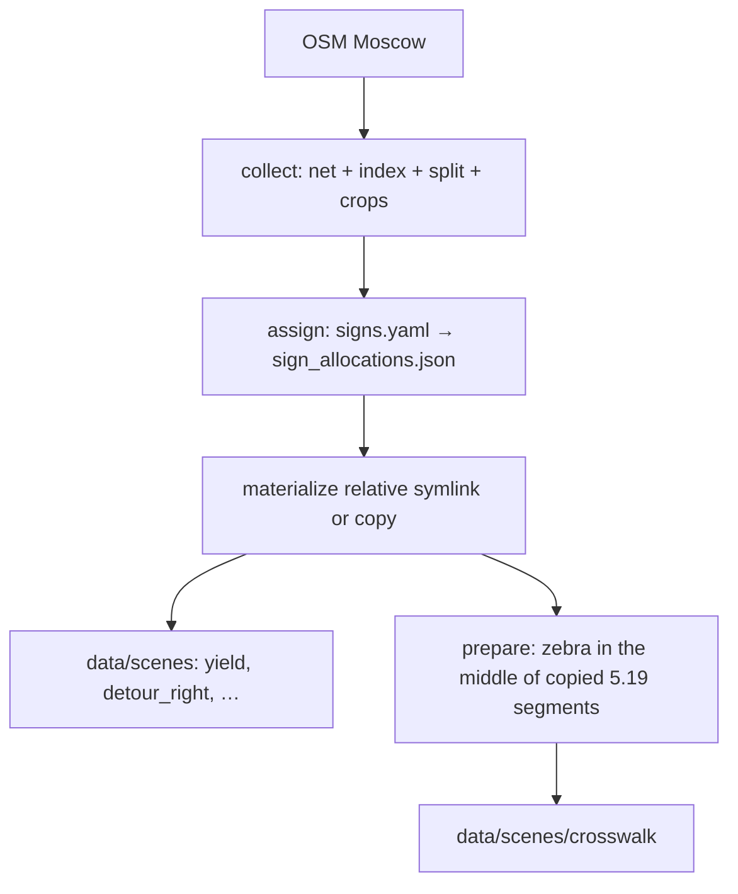

# scene_collection — Moscow maps without signs, then signs as queries

Two stages:

1. **collect** — OSM → `maps/` (net, index, train/test stamp, crops).
2. **assign / materialize / prepare / filter** — each sign samples that pool
  (`maps/splits/signs.yaml`) into `data/scenes/<sign>/`.

## Folders


| Path                                    | Role                                                        |
| --------------------------------------- | ----------------------------------------------------------- |
| `[collect/](collect/README.md)`         | OSM → city net → index → train/test stamp → crops           |
| `[assign/](assign/README.md)`           | `signs.yaml` queries → `maps/splits/sign_allocations.json`  |
| `[sign_scenes/](sign_scenes/README.md)` | Place maps into `data/scenes/<sign>/`, prepare, filter      |
| `[maps/](maps/README.md)`               | Harvested data only (nets, indexes, crops, splits)          |
| `[analysis/](analysis/README.md)`       | Counts + diversity figures (`analysis/figures/`)            |
| `paths.py`                              | Shared path constants (`MAPS`, `CROPS`, `DATA_SCENES`, …)   |
| `preview.py`                            | Top-down PNG from a cropped SUMO net (`custom_cropped.png`) |
| `cli.py`                                | `python -m traffic_bench.scene_collection <command>`        |


CLI (`--sign`, Hydra `sign=`) uses **eval profile ids** (`yield`, `roundabout`,
`crosswalk`, …), the same names as `generate_manifest.py`. Allocations in
`signs.yaml` / `sign_allocations.json` stay keyed by PDD code internally.

The independent unit of the benchmark is a **map**. Scenario augmentations
(≤10 per map) are correlated; quotas `n_train=80` / `n_test=20` are the
official protocol size, not the harvest size.

Default materialize mode is a **relative symlink** into `maps/crops/…`. That
survives remounting the NFS share. Use `--mode copy` if you need real
directories in-repo. `**pack`** follows those links into a standalone folder
you can copy off the machine without `maps/`.

## Three sizes


| Symbol | Meaning                             | This iteration                                          |
| ------ | ----------------------------------- | ------------------------------------------------------- |
| **P**  | Full Moscow population in the index | junctions 6457 (T 5181 / X 1052 / O 224); segments 7620 |
| **H**  | Cropped nets on disk                | **H = P** (crop until the city runs out; no cap of 500) |
| **N**  | Official maps per sign              | 80 train + 20 test                                      |


T/X **50/50** in `signs.yaml` is PDD topology stratification, not Moscow’s
~~83% T mix. 20 test maps is a wide CI (~~±22 pp at p=0.5); that is the protocol,
not a sampling parameter of the harvest.

## Order

Stamp train/test on **place identity** before allocating to signs:

- junctions / dual_path: `junction_id`
- segments: `osm_way_id` (one street must not sit in both halves)




## Crop families

```
maps/crops/junction/{T,X,O}/
maps/crops/dual_path/{T,X}/{slot}/
maps/crops/segment/<scene_id>/
```

`straight` / `curved` / lane count are **tags** on a segment crop (`meta.json`),
not extra folders. dual_path is a different net (path-union bbox), which is why
it is its own family.

Signs that are **not** harvested this round: **5.15** (eval code stays; no
`lane_direction` in `signs.yaml`).

## From scratch

All commands from the repo root `traffic-rule-bench`.

```bash
# 1–3. OSM → net → enumerate → make_split → crop T/X/O + dual_path + segments
python -m traffic_bench.scene_collection collect --skip-existing

# 4. Query the pool per sign
python -m traffic_bench.scene_collection assign

# 5. Place maps into data/scenes/<sign>/ (5.19 also gets a mid-block zebra)
python -m traffic_bench.scene_collection materialize --all
# or for a specific sign
python -m traffic_bench.scene_collection materialize --sign yield
python -m traffic_bench.scene_collection reject --sign yield --apply --refill --loop

# Optional visual review, then refill
python -m traffic_bench.scene_collection review --scenes-dir data/scenes/yield
python -m traffic_bench.scene_collection review --scenes-dir data/scenes/yield --apply
python -m traffic_bench.scene_collection materialize --sign yield --refill

# Standalone folder (dereferences relative links; share without maps/)
python -m traffic_bench.scene_collection pack --sign yield --out dist/yield

# Harvest counts + diversity figures
python -m traffic_bench.scene_collection analysis
```

`collect` includes the train/test **split** (that step used to be missing from
`run_pipeline.py`). Skip stages with `--skip-download`, `--skip-netconvert`,
`--skip-enumerate`, `--skip-split`, `--skip-crop`, `--skip-dual-path`,
`--skip-segment`.

`materialize --all` includes every sign in yaml. Signs with a `prepare:` hook
(currently crosswalk) are copied, then that hook runs automatically — same as
`prepare --sign crosswalk`. `prepare` stays available to re-run. Preview PNGs
mark the zebra from the SUMO crossing edge.

### 6. Manifest (eval, not harvest)

```bash
python traffic_bench/eval/generate_manifest.py sign=yield paths.split=train
```

## How eval picks ego spawn

Dispatch: `sign_registry.spawn_strategy` → `generate_manifest.py`.

- Junction 2.1: layout, any arm, longest incoming ≥20 m. Harvest meta has no `road_id`.
- 2.3 / 2.4 / 2.5: secondary arms only (`ego_road_class="secondary"`).
- 4.3: roundabout entry.
- Dual-path: `meta.road_id` + `dual_path` paths from crop; lanes on that edge.
- Speed: `meta.road_id` = corridor; spawn at start; lanes `0..lane_count-1`.
- Detour 4.2.x: same `road_id`; **eval** picks the obstacle lane from
`vehicle_lane_indices` + `pass_right_ok` / `pass_left_ok`.
- Crosswalk after prepare: parse SUMO `crossing`, spawn on the approach to the
zebra — do not trust harvest `road_id` after the edge split.

Longitudinal spawn distances come from sim config, not harvest.

## Eval id ↔ PDD (harvested this round)


| `--sign` / `sign=`         | PDD    | Family                             |
| -------------------------- | ------ | ---------------------------------- |
| `main`                     | 2.1    | junction                           |
| `secondary`                | 2.3    | junction                           |
| `yield`                    | 2.4    | junction                           |
| `stop`                     | 2.5    | junction                           |
| `blocked_road`             | 3.2    | junction                           |
| `roundabout`               | 4.3    | junction                           |
| `no_entry`                 | 3.1    | dual_path                          |
| `no_turn_right`            | 3.18.1 | dual_path                          |
| `no_turn_left`             | 3.18.2 | dual_path                          |
| `direction_straight`       | 4.1.1  | dual_path                          |
| `direction_right`          | 4.1.2  | dual_path                          |
| `direction_left`           | 4.1.3  | dual_path                          |
| `direction_straight_right` | 4.1.4  | dual_path                          |
| `direction_straight_left`  | 4.1.5  | dual_path                          |
| `direction_left_right`     | 4.1.6  | dual_path                          |
| `one_way_right`            | 5.7.1  | dual_path                          |
| `one_way_left`             | 5.7.2  | dual_path                          |
| `speed_limit`              | 3.24   | segment                            |
| `min_speed`                | 4.6    | segment                            |
| `residential_zone`         | 5.21   | segment                            |
| `zone_speed_limit`         | 5.31   | segment                            |
| `detour_right`             | 4.2.1  | segment                            |
| `detour_left`              | 4.2.2  | segment                            |
| `detour_either`            | 4.2.3  | segment                            |
| `crosswalk`                | 5.19   | segment + `prepare` zebra (middle) |


On-disk map layout: `[maps/README.md](maps/README.md)`.