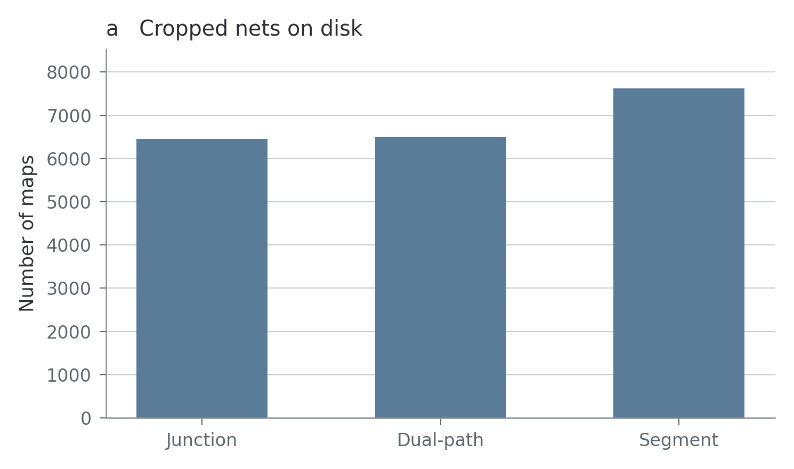
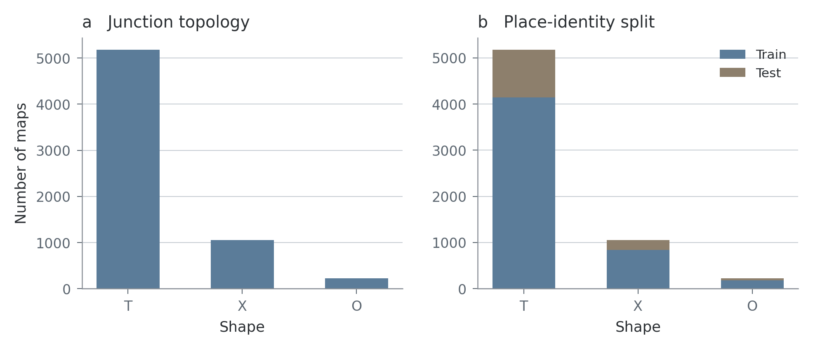
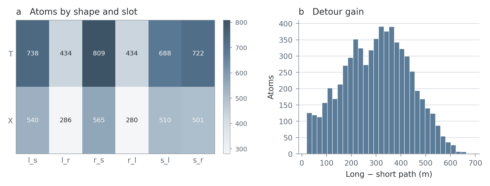
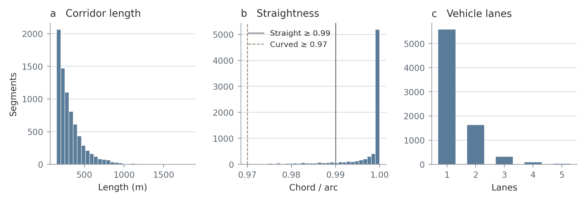
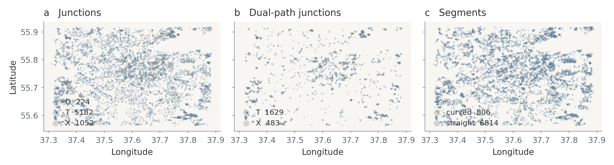
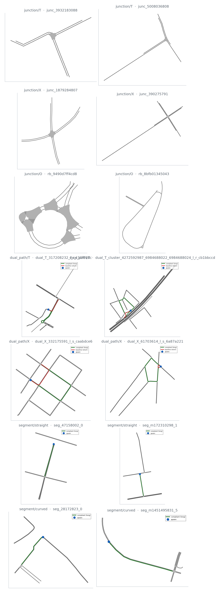

# Harvest inventory

Sign-free cropped SUMO nets on disk (`maps/crops/`).
Per-sign quota **N** = 80 train + 20 test is sampled later (`assign`);
it is not the harvest size.

## Reproduce

```bash
python -m traffic_bench.scene_collection analysis inventory
```

Outputs: this README, `summary.json`, PNGs under [`figures/`](figures/).

## Inventory

| Family | On disk |
| --- | --- |
| junction | 6457 |
| dual_path | 6507 |
| segment | 7620 |
| total | 20584 |



## Junctions (T / X / O)

| Shape | On disk | Train ids | Test ids |
| --- | --- | --- | --- |
| T | 5181 | 4145 | 1036 |
| X | 1052 | 842 | 210 |
| O | 224 | 179 | 45 |

Place identity (`junction_id` / `scene_id`) is split 80/20 *before*
allocation to signs, stratified by shape.



## Dual-path atoms

Each cell is one `(baseline, compliant)` slot among {l, s, r}.
The same junction may contribute at most one atom per slot.



## Segments (corridors)

Incoming edges cropped so the scene ends 10 m before the junction.
Gates: length ≥ 150 m; **straight** chord/arc ≥ 0.99; **curved** in [0.97, 0.99).

- distinct OSM ways: 5544
- `pass_right_ok`: 2044
- `pass_left_ok`: 2044



## Geographic coverage

Points are cropped nets on disk. Dual-path locations are unique parent junctions.



## Example crops

One net per cell. Labels are `family/group` and `scene_id`.


